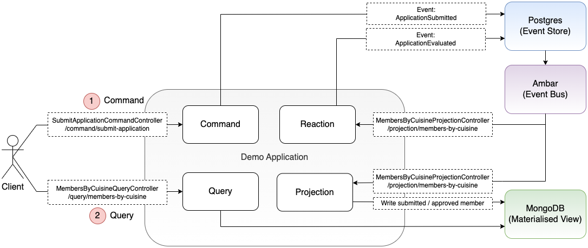
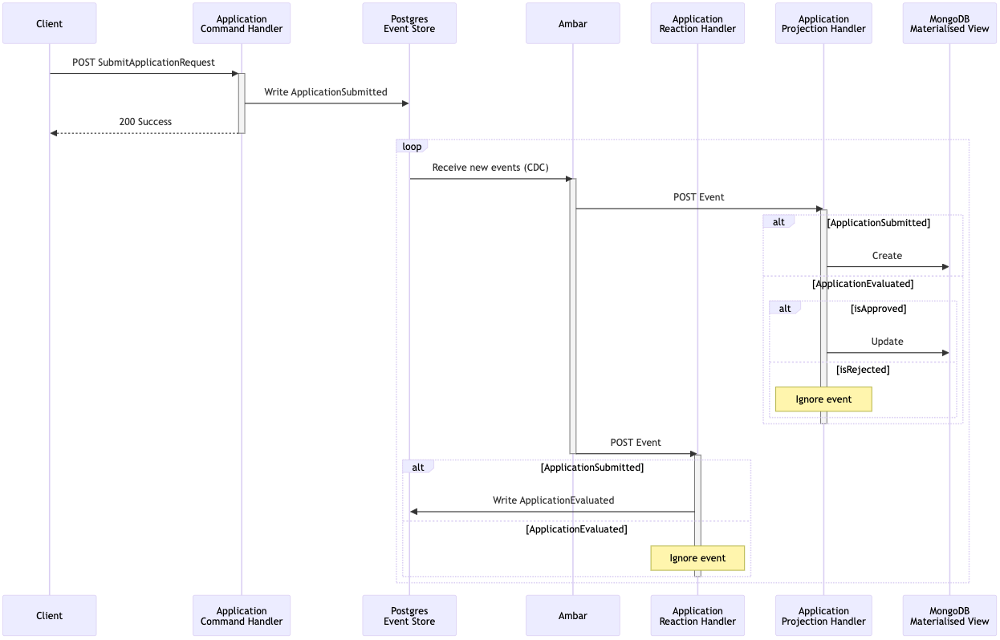
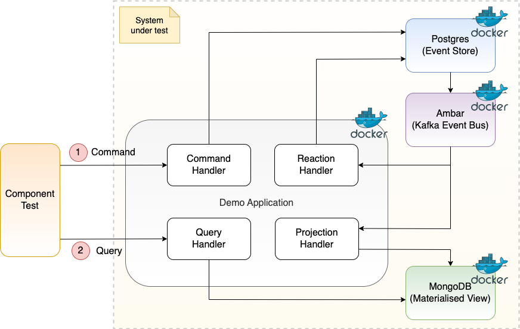
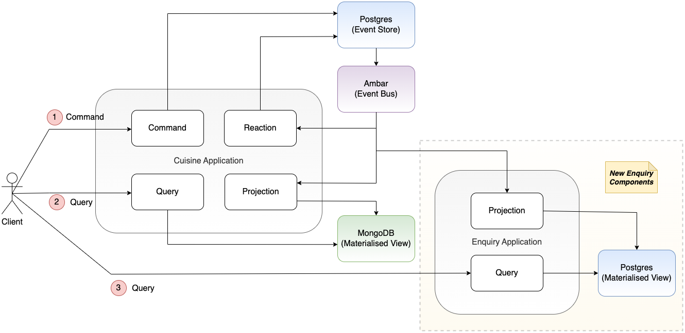

# Event Sourcing with Ambar

This repository contains a starter pack for **Event Sourcing with Ambar**.  It is a production grade starting point provided by [Ambar](https://ambar.cloud/).

## Application Overview

An application to join a cookery club is submitted and is either approved or rejected.

The applicant is approved if they do not have professional experience and have read some cookery books.

The materialised view shows all membership applications, and all approved members by favourite cuisine.

The following system architecture shows the application components, along with Postgres (used as the event store), Ambar, and MongoDB (used as the materialised view):



These are the steps for a client submitting an application request:

1. Client calls application REST API to submit an application to join the cookery club
2. Application writes ApplicationSubmitted event to event store
3. Ambar calls application to project (write) submission to material view
4. Ambar calls application to react to ApplicationSubmitted event
5. Application ReactionHandler writes ApplicationEvaluated event to event store (determines whether applicant is approved)
6. Ambar calls application to project (write) applicant approved to material view (ignores rejection)
7. Ambar calls application to react to ApplicationEvaluated, which is ignored

The following sequence diagram describes this flow:



## Getting Started

To run this application you need Docker. Once you have Docker installed, please clone the code, navigate to the `local-development/scripts` folder.

```bash
git clone git@github.com:ambarltd/event-sourcing-java.git
cd event-sourcing-java/local-development/scripts/linux # if you're on linux
cd event-sourcing-java/local-development/scripts/mac # if you're on mac
./dev_start.sh # start docker containers
./dev_demo.sh # run demo
```

You can then open your browser to:
- [http://localhost:8080](http://localhost:8080) to ping the backend
- [http://localhost:8081](http://localhost:8081) to view your event store
- [http://localhost:8082](http://localhost:8082) to view your projection store

## Additional Scripts

Whenever you build a new feature, you might want to restart the application, or even delete the event store and projection store.

```bash
cd event-sourcing-java/local-development/scripts/linux # if you're on linux
cd event-sourcing-java/local-development/scripts/mac # if you're on mac
./dev_start.sh # starts / restarts the application.
./dev_start_with_data_deletion.sh # use this if you want to delete your existing event store, and projection db, and restart fresh.
./dev_shutdown.sh # stops the application
```

## Side Project Challenge

### Overview

The existing application has not been changed, but rather two important use cases for applications using event sourcing have been identified and demonstrated.

1. Component testing an application that uses Ambar
```
Given an application is being developed
And the application integrates with Ambar
Then tests that validate this integration should be straightforward to create and execute
```
Benefits: Testing an application’s integration with external systems like Ambar as a black box ensures correctness of behavior and configurations. These tests should be simple to develop and run both locally and in the CI pipeline, ensuring consistency across environments. This approach enables early detection of integration issues and continuous validation of system functionality.

2. Handling the addition of a new service
```
Given a running system with existing events in the event store
When a new service is added
Then the new service should receive and process the existing events
```
Benefits: Event sourcing naturally supports the creation of new materialised views as business requirements evolve. The ability to seamlessly introduce a new service into the ecosystem that can process historical events without disrupting the existing architecture provides significant flexibility and scalability.

### 1. Component Testing an Application that Uses Ambar

#### Overview

The component tests treat the application and its dependencies as a black box, interacting with the system via the exposed application REST API to submit applicant requests and query the materialised view to validate correctness.

The Postgres database, MongoDB database, Ambar instance, and the application under test are all spun up in docker containers using Lydtech's open source component test framework.



The following dependency is included in the [pom.xml](pom.xml) to pull in the framework:
```
<dependency>
    <groupId>dev.lydtech</groupId>
    <artifactId>component-test-framework</artifactId>
    <version>3.7.3</version>
    <scope>test</scope>
</dependency>
```

The [EndToEndCT](src/test/java/eventsourcing/component/EndToEndCT.java) component test is written using JUnit.  It sends submit application requests to the cuisine application and queries the materialised view all via the application's REST API, and asserts the expected entries are returned. 

The test is annotated with `@ExtendWith(ComponentTestExtension.class)` to hook into the component test framework.  The framework orchestrates [Testcontainers](https://testcontainers.com) for spinning up and managing the required docker containers for the system under test, including the [Ambar Testcontainer](https://github.com/lydtechconsulting/component-test-framework/blob/v3.7.3/src/main/java/dev/lydtech/component/framework/management/TestcontainersManager.java#L733).  The configuration for the component test is defined in the `maven-surefire-plugin` for the `component` profile in the [pom.xml](pom.xml). 

For more on the component test framework see: https://github.com/lydtechconsulting/component-test-framework

#### Steps To Run

Build Spring Boot application jar:
```
mvn clean install
```

Build docker container:
```
docker build -f Dockerfile-component -t ct/eventsourcing:latest .
```

Run tests:
```
mvn test -Pcomponent
```

Run tests leaving containers up:
```
mvn test -Pcomponent -Dcontainers.stayup
```

Manual clean up (if left containers up):
```
docker rm -f $(docker ps -aq)
```

### 2. Handling the Addition of a New Service

#### Overview

This demo adds a new service to an existing deployment that already has historic events stored in the event store. It demonstrates that those events will be delivered to the new application when the Ambar emulator is restarted.

The application provides an endpoint to receive notifications of membership submissions and evaluations, and writes the associated membership status updates to a Postgres materialised view.  This database can then be queried via the application's REST API.



The demo uses a separate Spring Boot application representing an enquiry service that is responsible for capturing membership status updates.  The repository for the application is here:
https://github.com/lydtechconsulting/ambar-enquiry-service.

#### Steps To Run

**In this (**`ambar-event-sourcing`**) project**:

1. Ensure that the Ambar configuration for the enquiry endpoint `Enquiry_CookingClub_Membership` is commented out in the [ambar-config.yaml](https://github.com/lydtechconsulting/ambar-event-sourcing/blob/main/local-development/ambar-config.yaml#L48) file.

2. Start the Ambar docker containers and run the demo to populate the event store with events (as described in [#Getting Started](https://github.com/lydtechconsulting/ambar-event-sourcing#getting-started) above).
```
./dev_start.sh
./dev_demo.sh
```

**In the** [ambar-enquiry-service](https://github.com/lydtechconsulting/ambar-enquiry-service) **project**:

3. Build the enquiry service Spring Boot application (with Java 21), build the docker container, and start the application `ambar-enquiry-service` and the Postgres database in docker containers:
```
mvn clean install
docker build -t ambar-enquiry-service .
docker-compose up -d
```

**In this (**`ambar-event-sourcing`**) project**:

4. Uncomment the Ambar configuration for the enquiry endpoint `Enquiry_CookingClub_Membership` in the [ambar-config.yaml](https://github.com/lydtechconsulting/ambar-event-sourcing/blob/main/local-development/ambar-config.yaml#L48) file.

5. Restart the Ambar emulator.  The historic events should be sent to the enquiry service projection endpoint, and written to the Postgres materialised view:
```
docker restart event-sourcing-event-bus
```

6. Query the materialised view via the enquiry service REST API to view all memberships, each with their latest status:
```
curl http://localhost:8099/api/v1/enquiry/cooking-club/membership/query/list
```
Observe the output:
```
[{"name":"Linda Thomas","status":"Approved","createdAt":"2025-01-18T16:47:50.343001Z","lastUpdatedAt":"2025-01-18T16:47:50.395517Z"},{"name":"Patricia Jones","status":"Rejected","createdAt":"2025-01-18T16:47:51.761195Z","lastUpdatedAt":"2025-01-18T16:47:51.810726Z"} ......... ]
```
